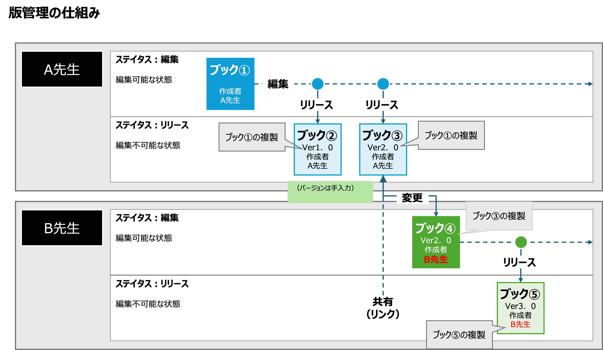

# CHiBi-CHiLOの版管理機能

## 1. 版管理について

版管理とは、ブックをある時点の状態で固定し、その版ごとに独立して管理する仕組みです。
これにより、年度ごとの教材運用や、版ごとの視聴履歴の管理が可能になります。

<figure><figcaption></figcaption></figure>

## 2. リリース機能

### 2-1. リリース機能について

版管理機能の追加により、編集中のブックを「リリース」することで版として固定できるようになりました。
これにより、年度単位での教材管理や、版ごとの視聴履歴の管理、共有運用の明確化が可能となります。

### 2-2. 操作方法の変更点

- ブックを「リリース」すると，その状態で複製され，「版」が固定
- 版ごとに視聴履歴を独立管理
- リリースされたブックは，共有設定により第三者による利用が可能
- 共有されたブックは，第三者が複製のうえ，独自に変更・再利用可能
- 各版の変更履歴（変更日・変更者）の管理が可能（データプロベナンス機能）

**① LMS へのブック配信方法（2通り）**

| 方法 | 内容 |
|------|------|
| 編集中のブックをそのまま配信 | 従来通り。変更が即座に反映される |
| リリース後に配信 | 版として複製してから配信。版ごとの視聴管理が可能 |

**② ブックの共有（シェア）**

- 第三者へ提供するには，事前にリリースしてから共有する必要がある

**③ その他の変更**

- 「著作権者」を自由記述で追加可能（作成者・共同作成者・協力者以外も設定可）
- ブックとブック内のトピックをまとめて削除可能

## 3. シェア機能の移行対応

### 3-1. 現行シェア機能の廃止

- 現在のシェア機能は廃止となる

### 3-2. 既存シェア状態の扱い

- アップデート前にシェアされていた教材にはリリースを促す注意書きが表示される
- 設定を行わない場合，旧仕様による共有状態が継続される（詳細は下記「対応方針」参照）

### 3-3. 対応方針

| 対応 | 長所 | 短所 |
|------|------|------|
| リリースしない | なにもしなくていい | 新規で共有できない  将来的にデータの整合性が保証されない |
| リリースして共有したものを，改めて再利用してもらう | 今後もデータの整合性が保証される | リリースして共有が必要となる |