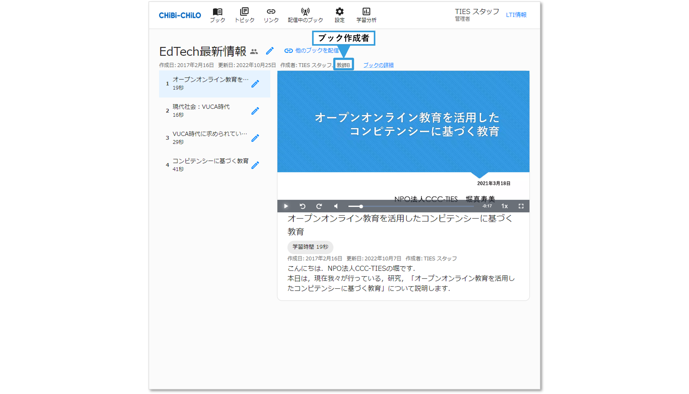

# - ブックの作成者・著作権者の設定

## 1．作成者・著作権者の設定について

### 作成者

CHIBI-CHILOでは，作成したユーザーに加えて，任意のユーザーをブックやトピックの作成者として追加指定することができます．

作成者を追加した場合，追加されたユーザーは，ブックやトピックの編集が可能となるほか，複数指定することで，ブックやトピックの共同作成，教材作成支援者のブックやトピックの作成代行が可能となります．

### 著作権者

作成者とは別に，著作権者を設定できます。自由記述で設定できますので，ユーザーの追加は必要ありません。

なお，トピックでも作成者・著作権者の追加を行いたい場合は，以下を参照してください．


[author.md](../3-topic/author.md)


以下は，ブックの作成者・著作権者の設定方法について説明します．

## 2．作成者の設定

#### ❶ 登録するユーザのメールアドレスを入力して追加

ブックの作成・編集画面で，作成者のところにあるテキストボックスに，登録するユーザーのメールアドレスを入力し，右側にあるアイコン（このメールアドレスの教員を追加）をクリックします．

なお，作成者は設定した時点で反映されます．


LMSから一度もCHIBI-CHILOにアクセスしていないユーザーは反映されませんので，設定したい教員のユーザーが表示されない場合は，そのユーザーでCHIBI-CHILOにアクセスしてください．


<figure></figure>

#### ❷ 表示（作成者・共同作成者・協力者）の選択

作成者のリストボックスをクリックすると，表示（作成者・共同作成者・協力者）を選択可能です． 機能や権限に違いはないため，お好みで設定してください．

<figure></figure>

### 作成者設定の削除

各作成者の右側にある「ー」のアイコン（この教員を取り除く）をクリックします．

<figure><figcaption></figcaption></figure>

ーをクリックした作成者の情報が削除されます．


ブックを最初に作成したユーザーは，作成者の一覧から削除できません． 「作成者」とは別の教材作成支援者がブックの作成を代行した場合は，「協力者」に設定すると，ブック閲覧画面で，作成者の後に名前が表示されます．


### 作成者設定の確認

設定した作成者は，ブック閲覧画面の上部にある，「作成者」から確認できます．

<figure><figcaption></figcaption></figure>

## 3．著作権者の設定

❶ブック編集画面の「メタ情報」から，著作権者を入力します。

<figure><figcaption></figcaption></figure>
あ
<figure><figcaption></figcaption></figure>

❷メタ情報下部の「更新」をクリックすると，著作権者が反映されます。

<figure><figcaption></figcaption></figure>

### 著作権者設定の削除

❶ブック編集画面の「メタ情報」から，著作権者の入力を削除すると，著作権者が削除されます。

<figure></figure>

❷メタ情報下部の「更新」をクリックすると，著作権者が反映されます。

<figure><figcaption></figcaption></figure>

### 作成者設定の確認

設定した作成者は，ブック閲覧画面の上部にある，「著作権者」から確認できます．

<figure></figure>
