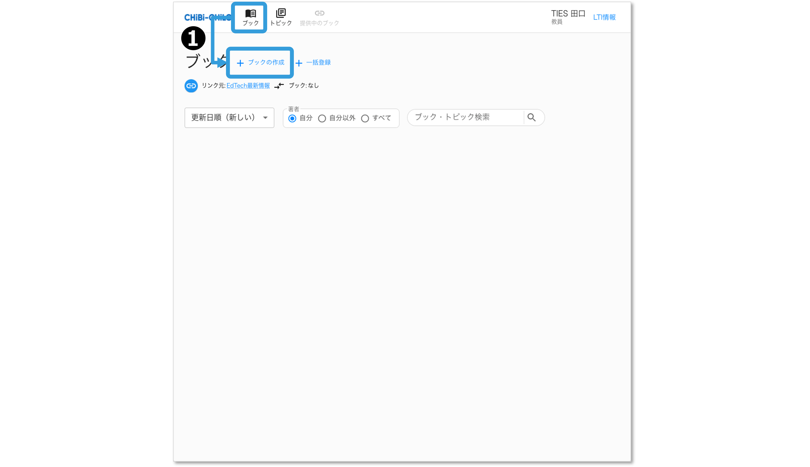
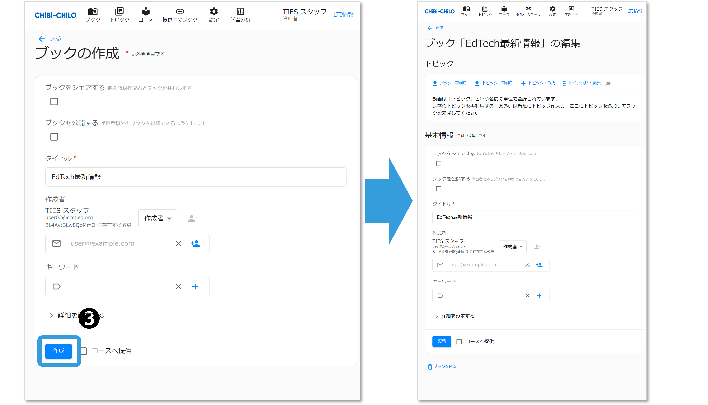
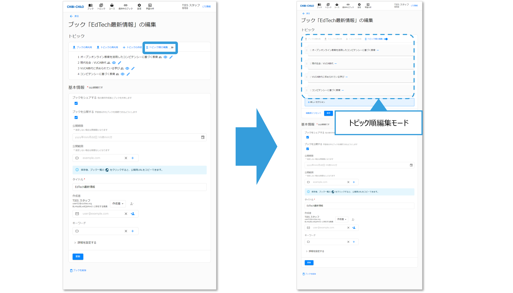
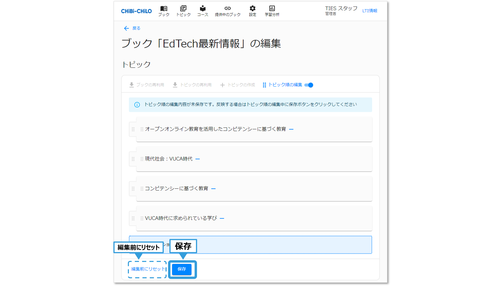

# - ブック作成の基本

CHIBI-CHILOへのアクセス方法は以下をご確認下さい．


[access.md](../1-chibi-chilo/access.md)


## 1. ブックの作成

### ❶「+ブックの作成」をクリック

CHIBI-CHILOのグローバルメニューの「ブック」をクリックしてブック一覧画面を表示し，「+ブックの作成」をクリックします．

<figure><figcaption></figcaption></figure>


初めてブックを作成する時はブック画面には何も表示されていませんが，ブックを作成すると作成したブックが一覧に表示されます．


### ❷ ブック基本情報の入力

ブック作成画面が表示されますので，必要項目を入力します．入力項目の詳細は以下の表をご確認下さい．

<figure><figcaption></figcaption></figure>

#### 入力項目の詳細

| 項目         | 内容                                                                                        |
| ---------- | ----------------------------------------------------------------------------------------- |
| ブックを公開する   | チェックを入れると学習者以外もブックを視聴できるようになります．（[参照](publish.md)）                                        |
| タイトル（必須）   | ブックのタイトルを入力します。                                                                           |
| 作成者        | 
作成者・共同作成者・協力者から選べます。 これとは別に，著作権者を入力することもできます。詳細はこちら（<a href="author.md">参照</a>）
 |
| キーワード      | 
検索や絞り込みに使用するキーワードを設定出来ます． 文字を入力して＋で追加，ーで削除します．（ <a href="keyword.md">参照</a> ）
   |
| 詳細を設定する→解説 | ブックの解説文を入力できます。（ [参照](commentary.md) ）                                                    |
| コースへ配信     | チェックを入れると，Moodleのコースで配信することができます．（[参照](release.md#id-6nobukkuno)）                         |

### ❸ 「作成」をクリック

❷の項目の入力後，「作成」をクリックすると，ブック編集画面が表示されます．

<figure><figcaption></figcaption></figure>

## 2．トピックの追加

### ❶ 「+トピックの作成」をクリック

ブック編集画面のトピック追加エリアの「+トピックの作成」をクリックすると，トピック作成画面が表示されます．以下を確認し，トピックを作成して下さい．


[create.md](../3-topic/create.md)


<figure><figcaption></figcaption></figure>

### ❷ 残りのトピックを作成

引き続き「+トピックの作成」をクリックし，残りのトピックを追加していきます．

### ❸ トピックの並べ替え・グループ化・除外

#### トピック順編集モードの開始と保存

「トピック順の編集」をクリックすると，トピック順編集モードに切り替わります．

<figure><figcaption></figcaption></figure>

操作が終わったら，「保存」をクリックします．なお，編集前にリセットをクリックすると，変更前の状態に戻ります．

<figure><figcaption></figcaption></figure>

トピックの並べ替え・グループ化・除外の操作は以下のように行います．

#### トピックの並べ替え

トピックタイトルの左端にあるアイコンをドラッグ・アンド・ドロップすることで，トピックの順番を並べ替えられます．

<figure><figcaption></figcaption></figure>

#### トピックのグループ化（セクションの追加）

トピック編集モードの状態で，ピックタイトルの左から2番目のアイコンをつまんで，グループ化したいトピックに重ねると，トピックをグループ化することができます．「セクション」と表示される部分にグループ名（セクション名）を記載します．

<figure><figcaption></figcaption></figure>

#### ブックからトピックを取り除く

トピック編集モードの状態で，トピックタイトルの右側の\[ー]をクリックすると，トピックをブックから取り除けます．

<figure><figcaption></figcaption></figure>

なお，ここでトピックを取り除いても，ブックから外されるだけで，トピック本体が削除されるわけではありません．トピック本体を削除する場合は，以下をご確認下さい．


[delete.md](../3-topic/delete.md)


## 3．メタ情報の追加

以下のメタ情報を追加できます。

| 項目       | 内容                                                               |
| -------- | ---------------------------------------------------------------- |
| 教材の主要な言語 | 主要な言語を日本語・英語から選択できます。                                            |
| ライセンス    | 適用するCCライセンスを選択できます。選択したライセンスは，ブック閲覧画面に表示されます。                    |
| 著作権者     | ブックに表示する著作権者を入力できます。入力した著作権者は，ブック閲覧画面に表示されます。（ [参照](author.md) ） |

## 4．ブックのリリース

完成したブックをリリースし，コースへ配信します。設定により，他の教員に共有することもできます。


[release.md](release.md)

