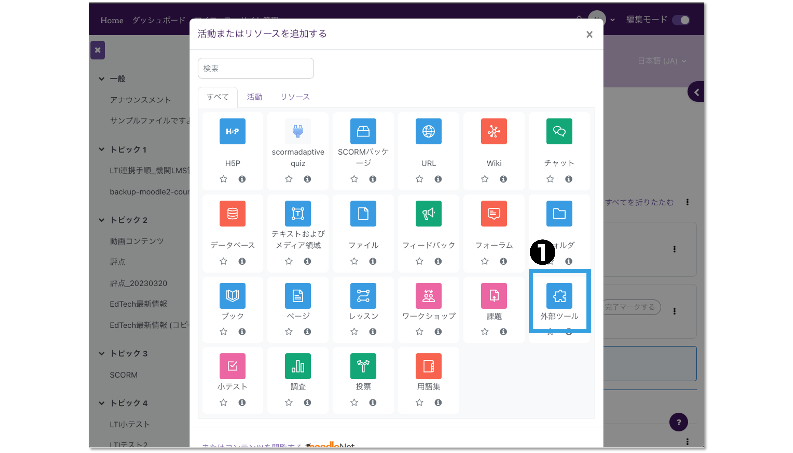
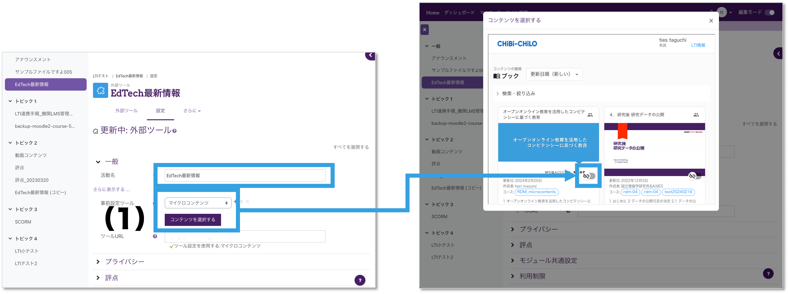
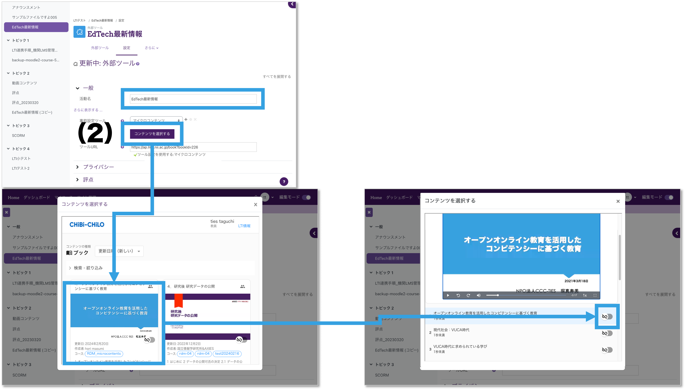
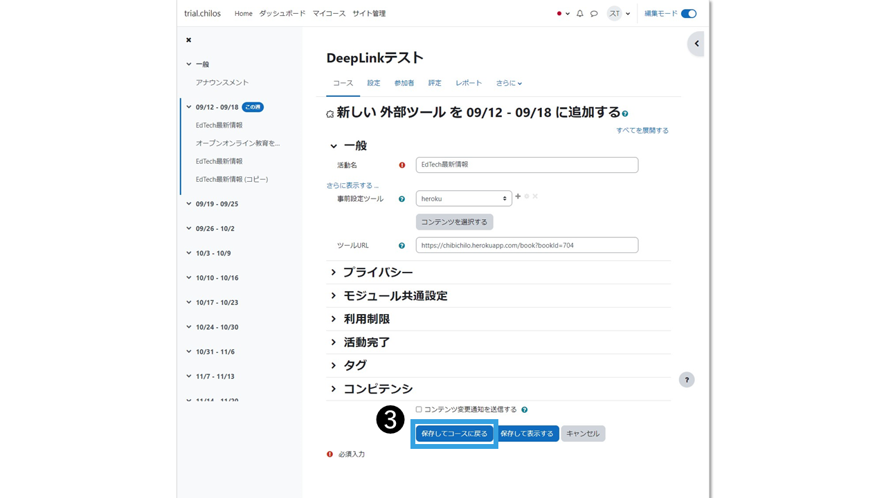

# - DeepLinkでブックを配信

## ❶コースから「マイクロコンテンツ」を追加

活動またはリソースの一覧から「マイクロコンテンツ」をクリックします．

<figure><figcaption></figcaption></figure>

## ❷「コンテンツを選択する」

### ❷-1 ブックを選択

「新しい外部ツール」の設定画面で「活動名」を入力し，「コンテンツを選択する」をクリックして，ブック一覧から，登録したいブックの配信ボタンをクリックします．

<figure><figcaption></figcaption></figure>

### ❷-2 トピックを選択

「新しい外部ツール」の設定画面で「活動名」を入力し，「コンテンツを選択する」をクリックして，ブック一覧からブックを選択した後，登録したいトピックの配信ボタンをクリックします．

<figure><figcaption></figcaption></figure>

## ❸保存してコースに戻る

配信ボタンをクリックすると，「新しい外部ツール」の設定画面に戻ります．「保存してコースに戻る」でコースに戻ります．

<figure><figcaption></figcaption></figure>

