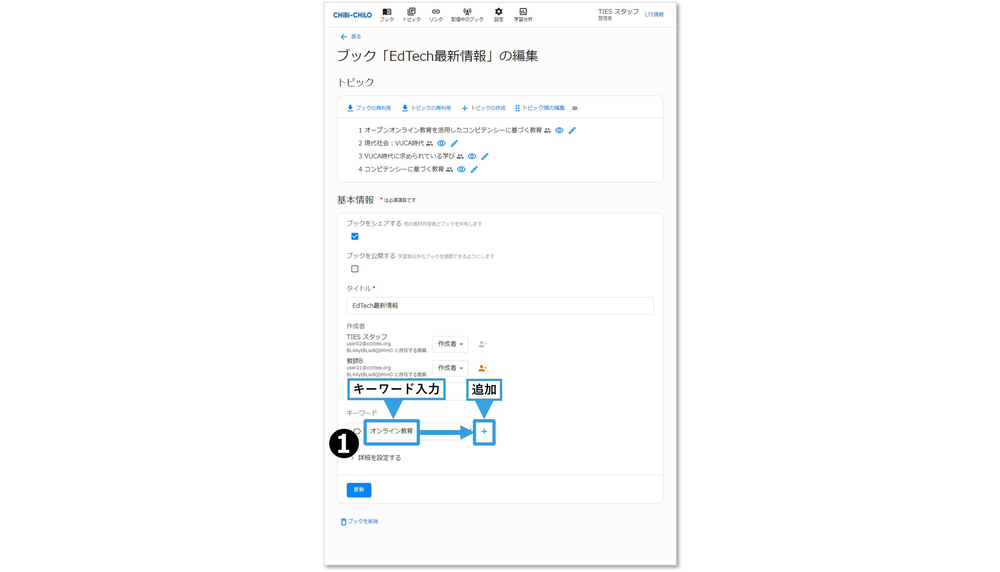

# - ブックのキーワードの設定

## 1．キーワードの設定について

ブックの作成・編集時にキーワードを設定すると，ブック一覧で検索や絞り込みに利用することができます．

検索や絞り込みの操作については，以下をご覧ください．


[search.md](search.md)


なお，キーワードの設定はトピックにもあります．トピックのキーワード設定については，以下をご覧ください．


[keyword.md](../3-topic/keyword.md)


## 2．ブックのキーワードの入力・削除

❶ブックの作成・編集画面で，キーワードの入力欄に文字を入力して＋で追加します．

<figure><figcaption></figcaption></figure>

❷入力したキーワード削除する場合は，キーワードの横にある×ボタンをクリックします．

<figure><figcaption></figcaption></figure>

❸作成または更新をクリックします．

<figure><figcaption></figcaption></figure>
