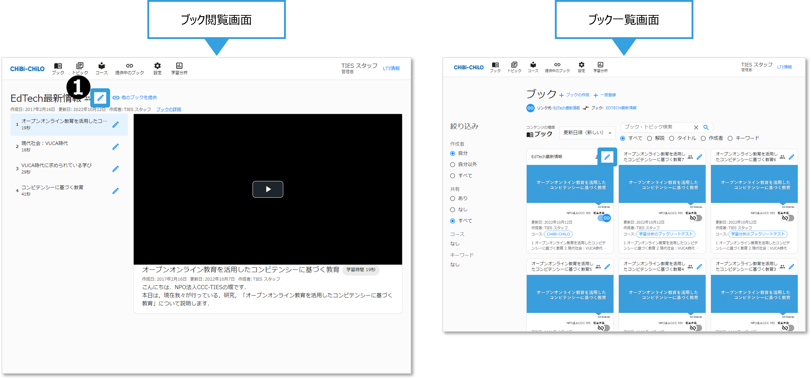

# - ブックのリリースと配信

## 1．リリースとは

CHIBI-CHILOの版管理機能により，作成者が意識的に **「リリース」** した版をバージョン管理できます。

これにより，以下のようなことが行えます。

* 特定の段階でのバージョンをコースに配信しながら，最新版の編集を行う
* バージョンごとに視聴履歴を取る
* 共有して，他の作成者にブックを共有する

以下では，リリース，コースへの配信の手順をご説明します。

## 2. 新しい版のリリース

❶完成したブックの編集画面でページ下部にある **「ブックをリリース」** を選択します。

<figure></figure>

❷ブック「（ブック名）」をリリースします。よろしいですか？と表示されますので，「OK」をクリックします。

❸ **バージョン（必須）** と **コメント** を入力します。ブックを他の作成者と共有する場合は， **「ブックを共有する」** にチェックを入れます。

❹ **\[作成]** ボタンをクリックすると，リリースが作成されます。

<figure><figcaption></figcaption></figure>

## 3. リリースした版の確認

リリースしたブックの編集画面に移動します。

<figure><figcaption></figcaption></figure>

リリースしたブックは，タイトルやトピックの内容は編集できなくなりますが，以下は引き続き編集ができます。

* 公開の設定
* バージョン・コメント・共有設定
* メタ情報
* コースに配信のチェック

最下部のリリース一覧で，作成したリリースのバージョンとリリース日を確認できます。 えんぴつアイコンをクリックすると，編集画面に移動します。

<figure><figcaption></figcaption></figure>

### 編集中のブックの確認・修正

リリース後も，編集中のブックは引き続きタイトルやトピック内容を含めた編集が可能です。

ブック一覧から， **「編集中」** で絞り込んで，編集したいブックのえんぴつアイコンをクリックします。

<figure><figcaption></figcaption></figure>

### ブック一覧で確認・プレビュー

ブック一覧で **「リリース」** で絞り込むと，リリースしたブックを確認・プレビューできます。

プレビューの際，ブックの詳細を編集するをクリックすると，直前のリリースが表示されます。

## 4. LMSからのリンク設定

作成したブックをLMSの外部ツールにリンクします．

### （1）ブック編集画面で配信設定する

リリースされたブック編集の画面で，コースへ配信にチェックをいれ，更新をクリックします．

<figure><figcaption></figcaption></figure>

ブック一覧画面にリンク元のLTIのタイトルとブックのタイトルが表示されます．

<figure><figcaption></figcaption></figure>

### （2）ブック一覧画面で配信設定する

ブック一覧画面で，「リリース」で絞り込みます。

<figure><figcaption></figcaption></figure>

配信するブックを選択し，アイコンをクリックするとに切り替わり，ブック一覧画面にリンク元のLTIのタイトルとブックのタイトルが表示されます．

<figure><figcaption></figcaption></figure>

## 5．ブックの配信確認

以上で，ビデオ教材の配信設定は終了です．以下の2通りの方法で，CHIBI-CHILOが配信されていることを確認できます．

### （1）LMSから確認

CHIBI-CHILOの画面を閉じて，LMS(Moodle）の画面に戻り，設定した外部ツールをクリックすると，設定したビデオが配信されていることを確認できます．

<figure><figcaption></figcaption></figure>

モバイルで見た場合

<figure><figcaption></figcaption></figure>

### （2）CHIBI-CHILOのナビゲーションメニューから確認

CHIBI-CHILO上部のナビゲーションメニューの「配信中のブック」をクリックすると，現在配信されているCHIBI-CHILOの閲覧画面を開くことができます．

<figure><figcaption></figcaption></figure>

## 6．（補足）編集中のブックの配信

必要に応じて，編集中のブックを配信することもできます。

❶ブック一覧から， 「編集中」 で絞り込みます。

<figure><figcaption></figcaption></figure>

❷配信するブックを選択し，アイコンをクリックするとに切り替わり，ブック一覧画面にリンク元のLTIのタイトルとブックのタイトルが表示されます．

<figure><figcaption></figcaption></figure>
