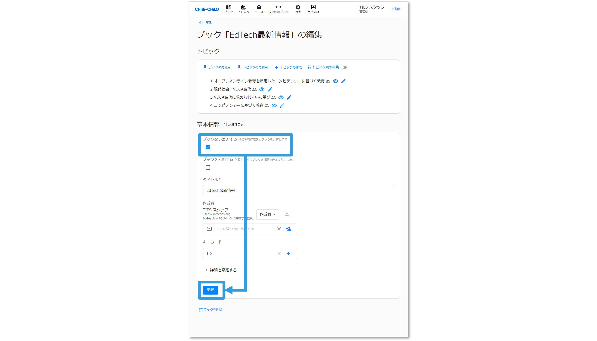
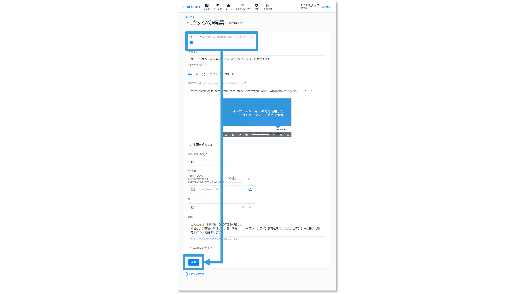
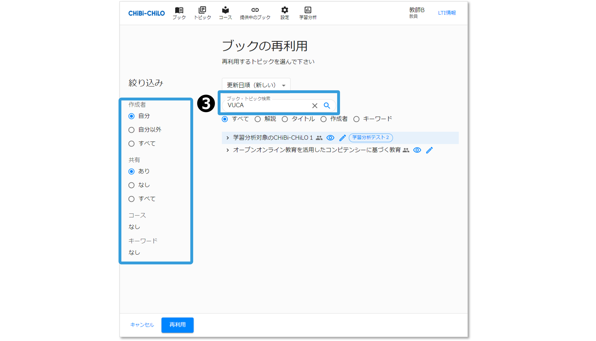
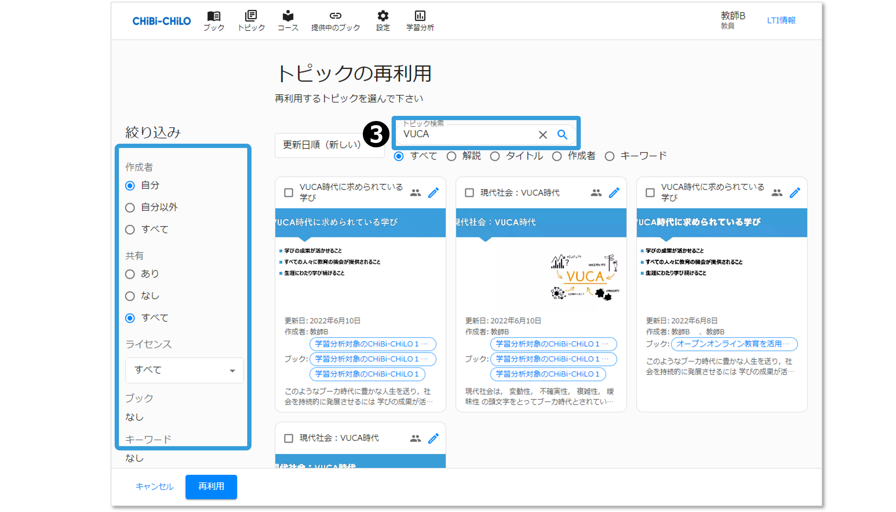
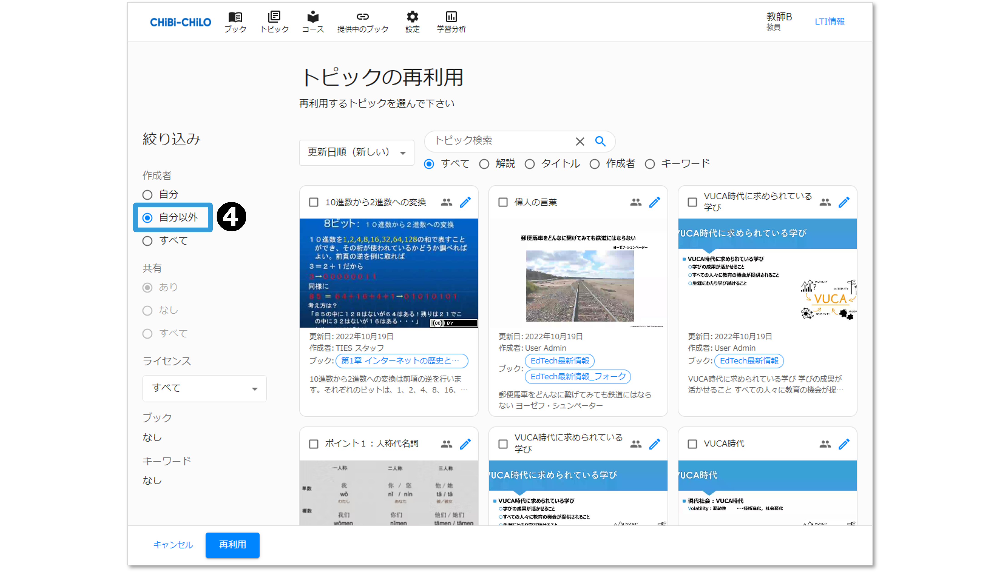
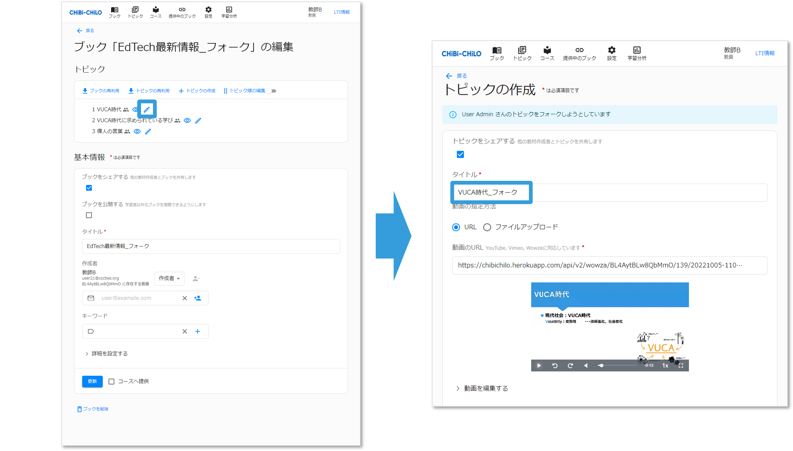

# - ブックの再利用・複製

## 1．再利用

自分が作成したブックや，他の作成者が共有したブックは，以下の手順で再利用が行えます。

### （1）ブックの再利用

❶ブックの作成または編集画面の「ブックの再利用」をクリックすると，ブック名の一覧が表示されます．

<figure></figure>

❷ブック一覧の検索画面と同様に，検索や絞り込みが可能です．

<figure></figure>

❸リリース（共有）を選択すると，他の作成者の共有されたブックが表示されます。

<figure></figure>

❹ブック名をクリックすると，トピックの一覧が表示されますので，チェックを入れて「再利用」をクリックすると，チェックを入れたトピックがブックに追加されます．

<figure></figure>

### （2）トピックの再利用

❶ブックの作成または編集画面の「トピックの再利用」をクリックすると，トピックの一覧が表示されます．

<figure></figure>

❷トピック一覧の検索画面と同様に，検索や絞り込みが可能です．

<figure></figure>

❸リリース（共有）を選択すると，他の作成者の共有されたブックのトピックが表示されます。

<figure></figure>

❹トピックにチェックを入れて「再利用」をクリックすると，チェックを入れたトピックがブックに追加されます．

<figure></figure>

## 2．ブックの複製

他の作成者の，共有されているブックは，以下の手順で複製が行えます。

❶CHIBI-CHILOのグローバルメニューの「ブック」をクリックしてブック一覧画面を表示し，絞り込みで **「リリース（共有）」** を選択します。

<figure></figure>

❷他の作成者のブックのえんぴつアイコンをクリックします。

<figure></figure>

❸画面下部の「ブックを複製」をクリックします。

<figure></figure>

❹OKをクリックすると，ブックが複製され，編集が可能になります。

<figure></figure>