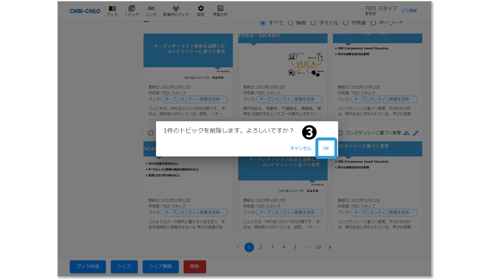
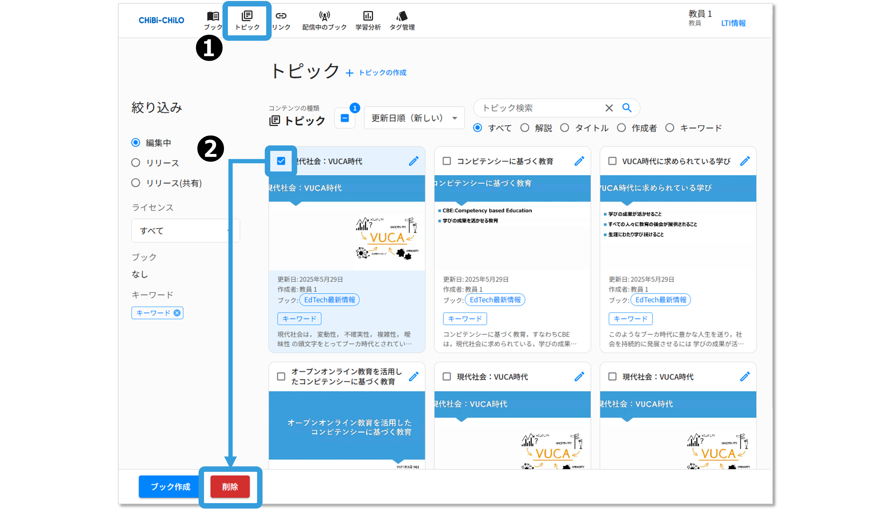
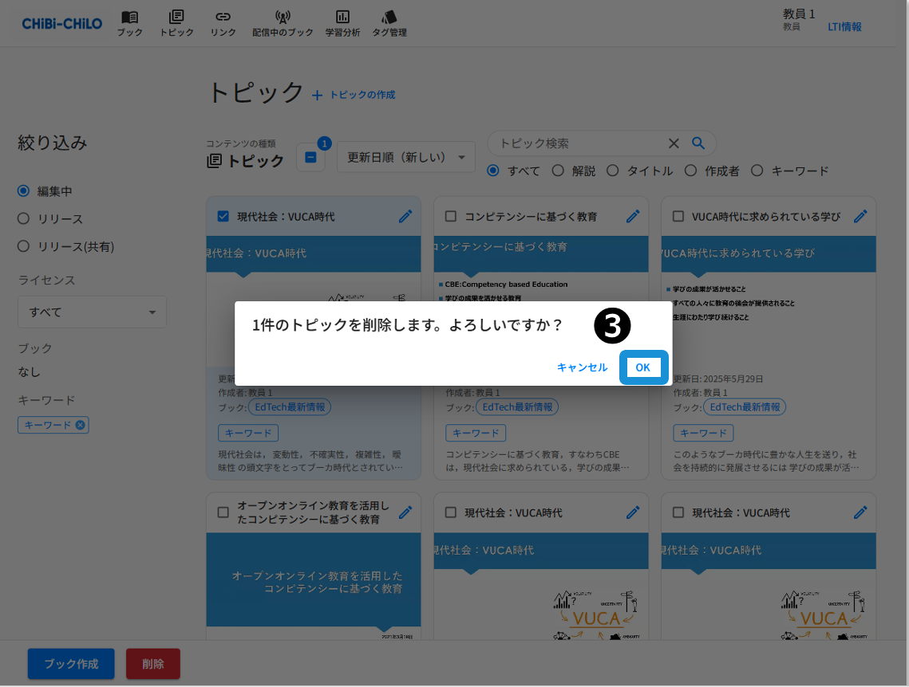

# - トピックの削除


ブックと，ブック内のトピックをすべて削除したい場合は，以下ページの，「ブック/トピックを削除」を行ってください。



[delete.md](../2-book/delete.md)


## （1）ブックの編集画面からトピックを削除

### ❶ ブックの編集画面を開く

ブック閲覧画面の，ブックタイトル横のえんぴつアイコン，またはブック一覧画面の削除したいブックのえんぴつアイコンをクリックして，ブックの編集画面を開きます．

<figure><figcaption></figcaption></figure>

### ❷ ブック内のトピックを削除する

ブックの編集画面で，トピックタイトル横のえんぴつアイコンをクリックし，画面下部の「トピックを削除」をクリックします．確認画面が表示されますので，OKをクリックします．

<figure><figcaption></figcaption></figure>

ブックの編集画面に戻ります．削除するトピックが残っている場合は，同じ作業を繰り返します．

## （2）トピック一覧からトピックを削除

### ❶ トピック一覧画面を開く

画面上部のナビゲーションメニューから「トピック」を選択し，トピック一覧画面を開きます．

### ❷ トピックを選択して「削除」

トピック一覧で削除したいトピックのチェックボックスを選択し， **「削除」** をクリックします（複数選択可）．

<figure><figcaption></figcaption></figure>

### ❸ 確認

削除の確認をされるので **「OK」** をクリックします．

トピックが完全に削除されます．

<figure><figcaption></figcaption></figure>
