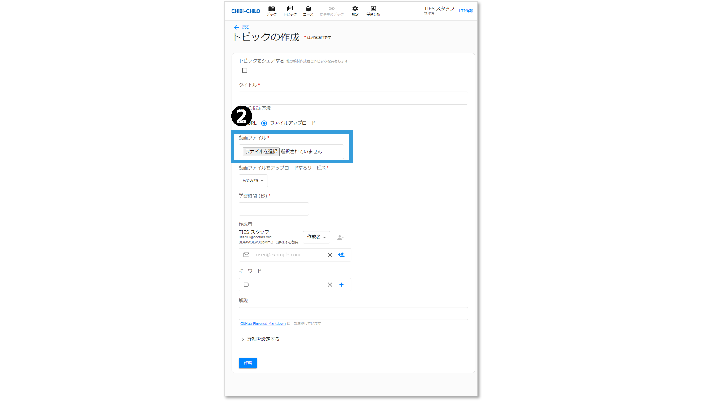
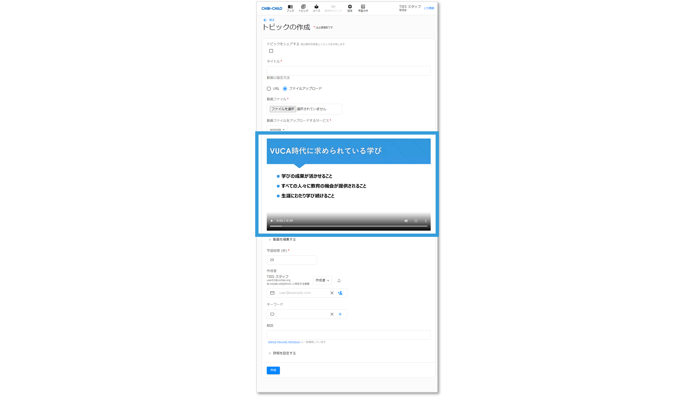

# - 動画のファイルアップロード


以下の手順はWowza対応のCHIBI-CHILOでのみ行なえます．



動画のファイルアップロードは，日本語のファイル名には対応しておりません．\
ファイルをアップロードする際は，あらかじめファイル名が半角英数字になっていることをご確認ください。


### ❶ 「ファイルアップロード」をクリック

「ファイルアップロード」をクリックします．

<figure><figcaption></figcaption></figure>

### ❷ 「ファイルを選択」をクリック

動画ファイルから「ファイルを選択」をクリックします．

<figure><figcaption></figcaption></figure>

### ❸ アップロードするファイルを選択

アップロードするファイルを選択し，「開く」をクリックします．

<figure><figcaption></figcaption></figure>

アップロードが完了すると，動画が表示されます．

<figure><figcaption></figcaption></figure>

### ❹ 画面下部の作成または更新ボタンをクリック


作成または更新ボタンを押した時点で，動画がストリーミングサーバーにアップロードされます．

動画の容量や回線などの影響で，アップロードに時間がかかる可能性がありますので，作成または更新ボタンを押した後，画面が自動的に切り替わるまでお待ちください．

