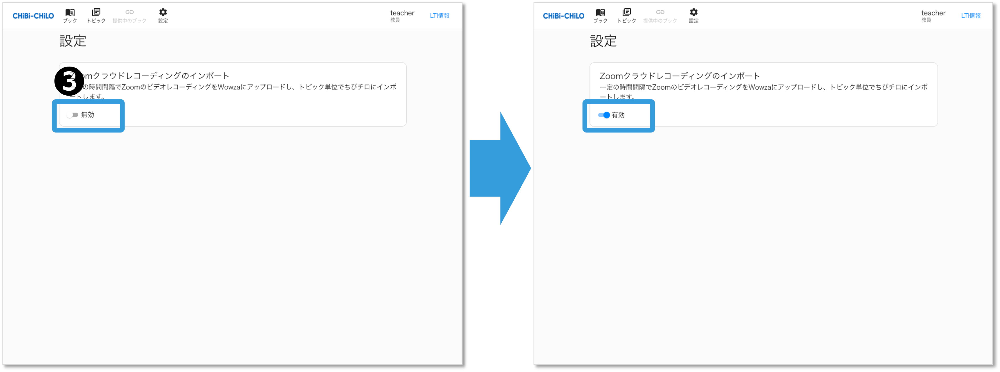
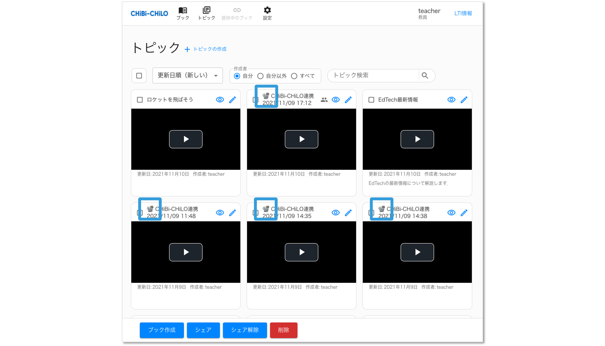

# - Zoom動画の取り込み

**※学認LMS向けのLTII-MCでは、本機能は利用できません。**

CHIBI-CHILOでインポートの設定をおこなったうえでZoom録画をおこなうと，CHIBI-CHILOに録画した動画が取り込まれ，ブックとトピックが作成されます．

## （1）事前設定


Zoomの動画をインポートするには，ZoomとLMSで同じメールアドレスを使用する必要があります．また，Zoomでクラウド録画をおこなう前にCHIBI-CHILOでインポートの設定をしておく必要があります．


### ❶ CHIBI-CHILOにアクセス

Zoomを使用したメールアドレスを使用しているアカウントでLMS（Moodle）にサインインし，CHIBI-CHILOにアクセスします．（[CHIBI-CHILOへのアクセス](../1-chibi-chilo/access.md) 参照）

### ❷ インポートの設定

ZoomとCHIBI-CHILOを連携した後の初回起動時に，zoomインポート機能の設定を確認されます．2回目以降は画面上部の「設定」をクリックしてインポート設定をおこないます．

<figure><figcaption></figcaption></figure>

### ❸ インポートを有効にする

「Zoomクラウドレコーディングのインポート」を有効にします．

<figure><figcaption></figcaption></figure>

## （2）Zoomで録画

### ❶ クラウドレコーディングする

Zoomの有料アカウントでサインインします．この際にZoomとLMSで同じメールアドレスを使用している必要があります．

Zoomでクラウドレコーディングをします．

### 動画が登録される

インポートを有効にした状態でクラウドレコーディングをおこなうと，CHIBI-CHILOにブックとトピックが生成され，トピックに録画した動画が登録されます． 動画の登録は一定の間隔でおこなわれるため，すぐには反映されない場合があります．（登録の間隔が知りたい場合は管理者に設定をご確認ください．）

## 補足：インポートしたブックとトピックについて

Zoomのクラウド録画で作成されたブックとトピックは，タイトルがZoomのミーティング名と日時となっており，学習時間や解説は空白となっています．
