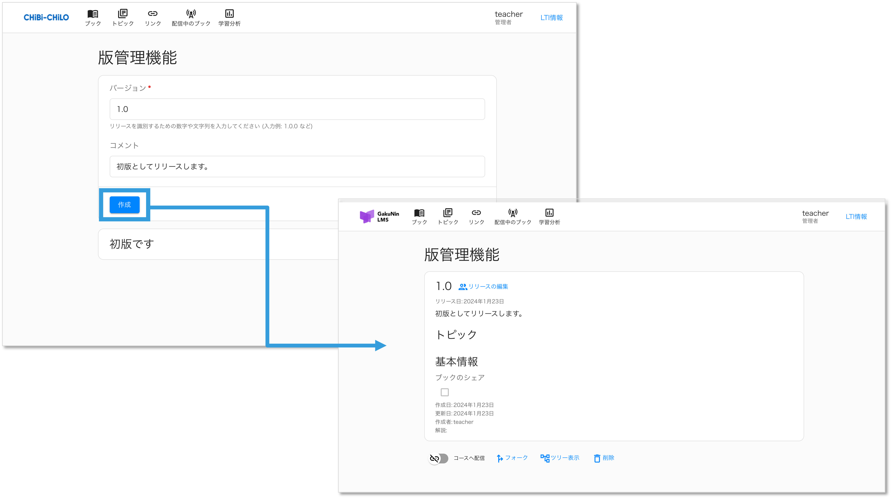

# - 版管理機能の使い方

## 1. 新しい版のリリース

完成した版がある場合、それをリリースとしてマークします。\
ブック編集画面でページ下部にある **「リリース」** を選択します。

バージョンとコメントを入力し， **\[作成]** ボタンを選択します。リリース結果が表示されます。

## 2. リリースした版の閲覧


ブックやトピックのページから、リリースした版を閲覧できます。 バージョン管理セクションやリリース履歴からアクセスできます。


ブック編集画面でページ下部にある **「ツリー表示」** を選択します。\
現在開いているブックの○が青色で表示されます。

**「拡大」** や **「縮小」** ， **「リセット」** を選択すると，ツリー表示サイズを調整できます。

### フォークしたブックの詳細を確認する

ツリー表示にある各フォークの **「○」** を選択すると，版管理のブック詳細が表示されます。

## 3. フォークによる編集と改変


リリース後に編集や改変が必要な場合、フォーク機能を使用します。 フォークした版は新しい編集が可能なコピーとして作成されます。


フォークについて（[詳細はこちら](broken-reference)）

リリースした画面でページ下部にある **「フォーク」** を選択します。\
確認のメッセージが表示されるので **「OK」** を選択します。

編集可能なコピーが表示されます。

フォークして編集が完了したら，変更を元のプロジェクトに統合します。 必要に応じて新しいリリースを作成してプロジェクトに適用します。 以上が，版管理機能の基本的な概要と利用手順です。これにより，プロジェクトの進化に伴う変更を効果的かつ整然と管理できます。
