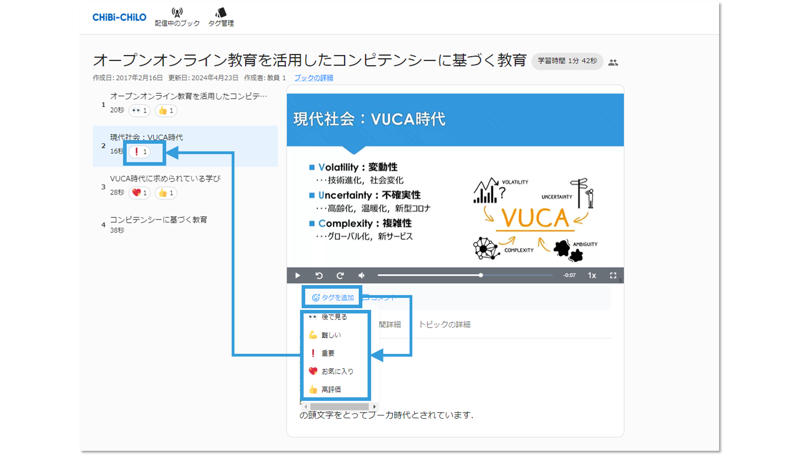

# - ファイルアップロード


以下の手順はWowza対応のCHiBi-CHiLOでのみ行なえます．


### ❶ 「ファイルアップロード」をクリック

「ファイルアップロード」をクリックします．

<figure><figcaption></figcaption></figure>

### ❷ 「ファイルを選択」をクリック

動画ファイルから「ファイルを選択」をクリックします．

<figure><figcaption></figcaption></figure>

### ❸ アップロードするファイルを選択

アップロードする動画ファイルを選択します．

.png>)

アップロードした動画が表示されます．

<figure><figcaption></figcaption></figure>
