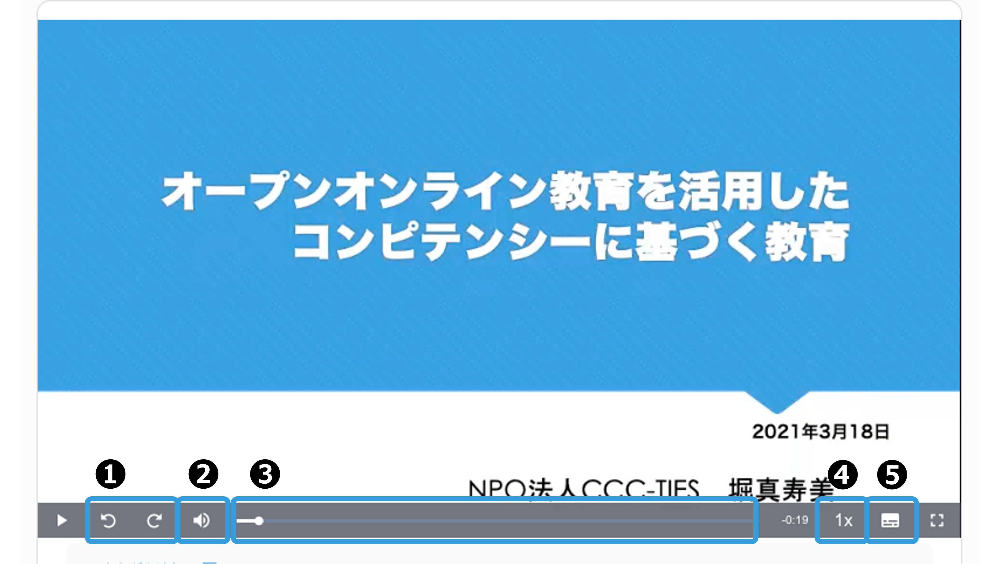
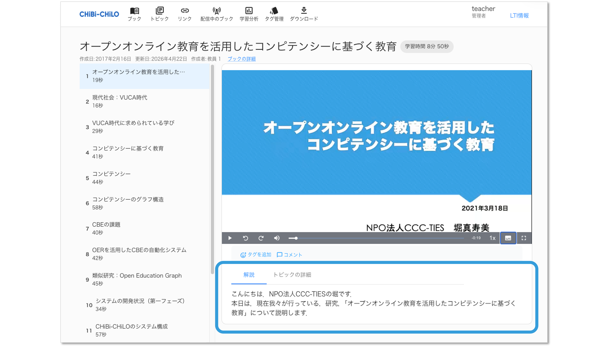
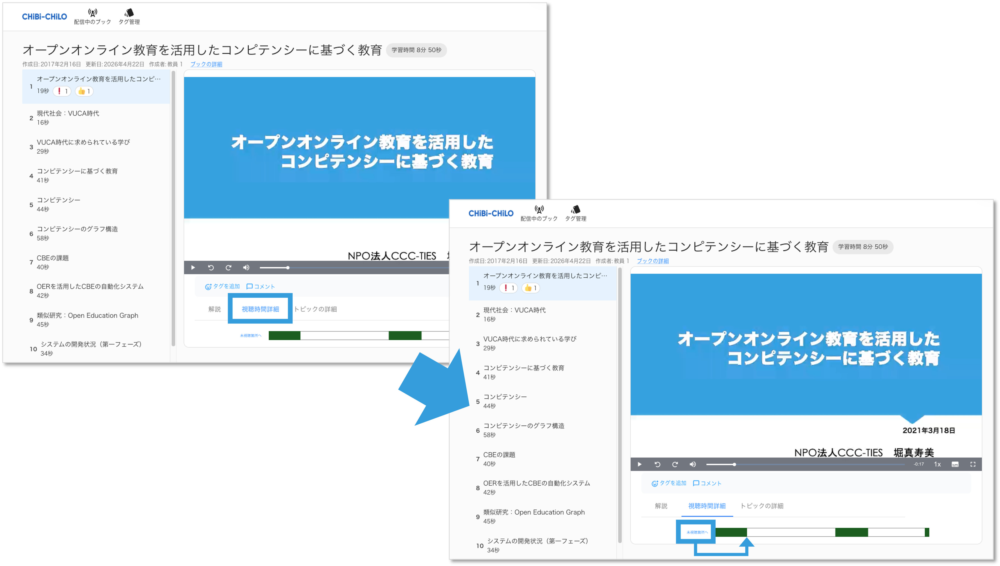
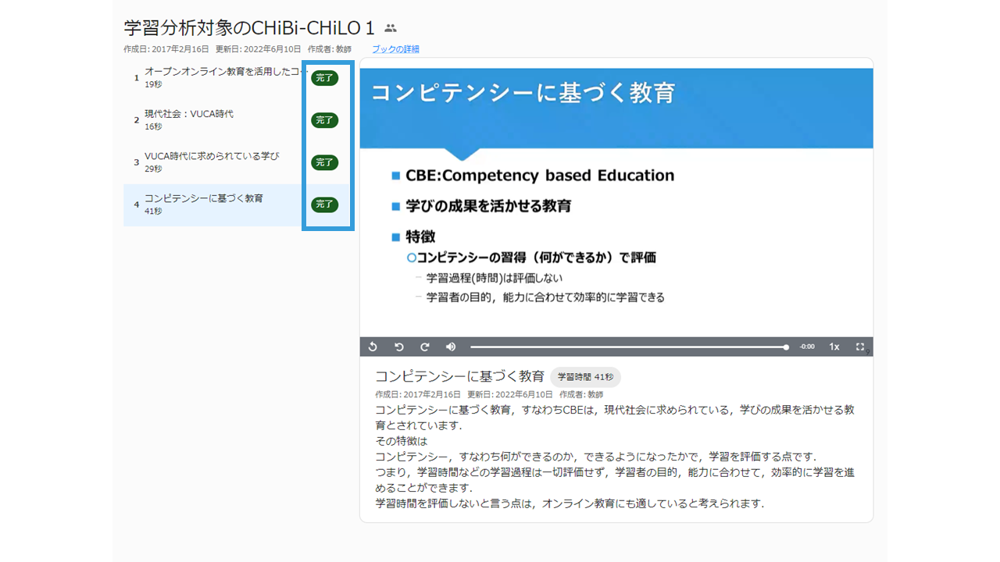

# 🆕 プレイヤーの操作方法

## 操作方法

学習する際にプレイヤーの操作が可能です．

| 項目     | 内容                           |
| ------ | ---------------------------- |
| ❶戻る/進む | 15秒ずつ移動出来ます                  |
| ❷音量    | 音量を調整出来ます．                   |
| ❸シークバー | 再生位置を調整出来ます．                 |
| ❹再生速度  | 再生速度を調整出来ます．0.25〜2倍まで選択可能です。 |
| ❺字幕    | 字幕を表示出来ます．                   |

##　その他の情報

### 解説

プレイヤー下部に解説文が表示されます．学習の際の参考に利用出来ます．

### 視聴時間の確認

プレイヤー下部の視聴時間詳細タブをクリックすることで，動画の未視聴箇所を確認することが出来ます．\
緑色部分が視聴済み，白色部分が未視聴の箇所です． \
**「未視聴箇所へ」** をクリックすると，未視聴範囲の最初に移動します．

### 完了ラベルの表示

トピック内の動画を最後まで視聴すると，目次のトピック名の右に， **「完了」** のアイコンが表示されます．

