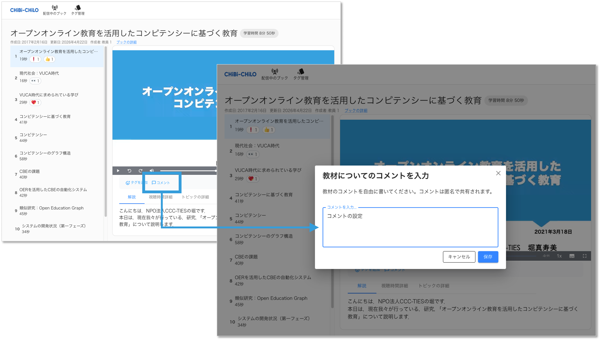
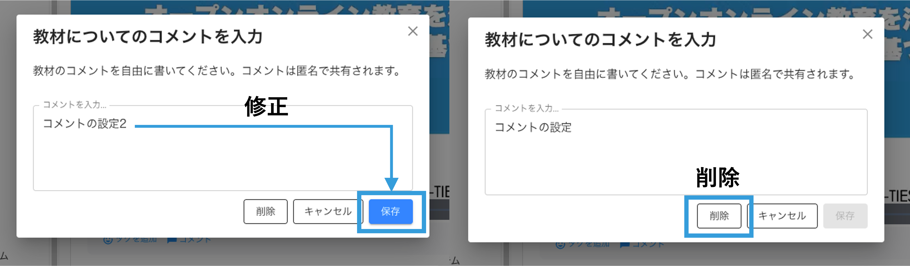
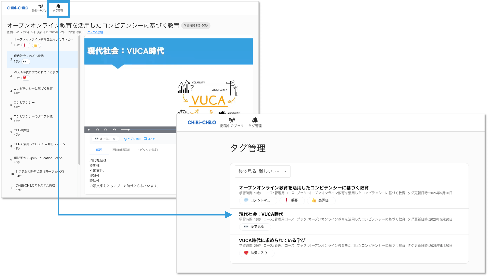

# 🆕 タグの設定

## タグを追加

プレイヤー下部の **「タグを追加」** からトピックごとにタグを設定出来ます．追加した場所とトピックリストに追加したタグが表示されます． \
削除する場合は設定したタグの **x** をクリックします．

## コメントの設定

プレイヤー下部の **「コメント」** からトピックごとにコメントを設定出来ます．テキストを入力して **[保存]** ボタンをクリックします．

設定後にテキストを修正して再度 **[保存]** ボタンをクリックすると設定したコメントが更新されます．\
**[削除]** ボタンをクリックするとコメントが削除されます．

## タグ管理

画面上部の **「タグを管理」** から設定したタグやコメントを確認出来ます．

