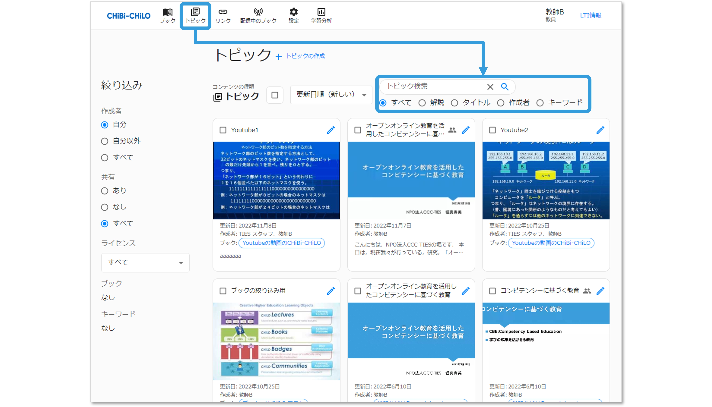
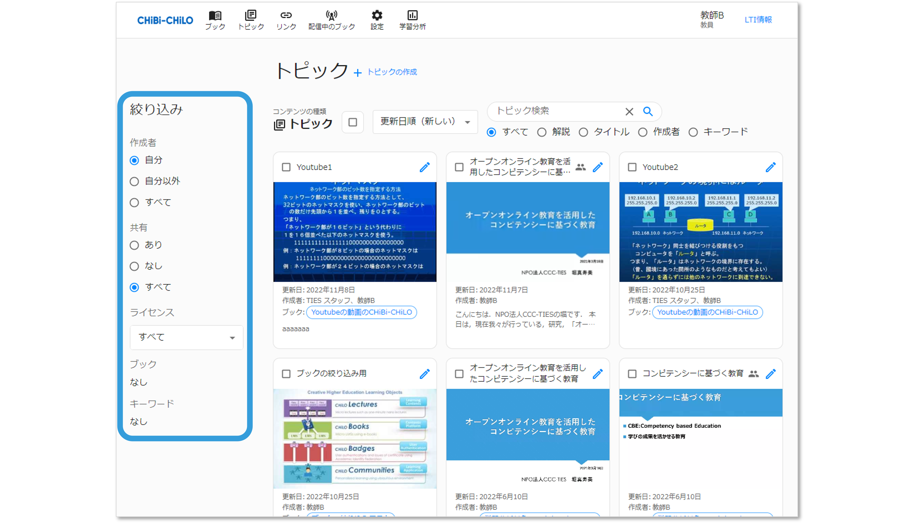
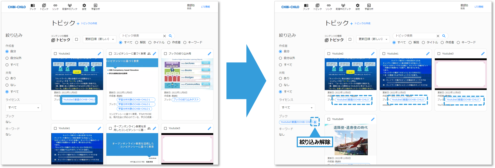
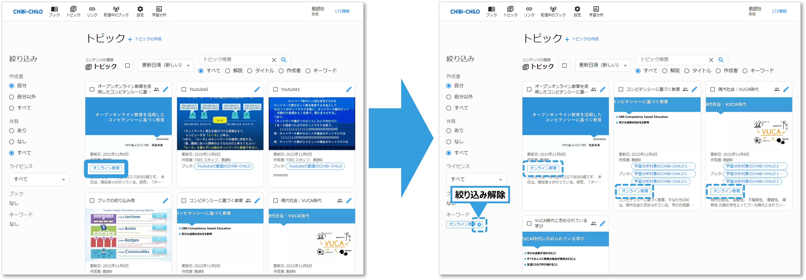

# - トピックの検索

## 1．トピックの検索

CHiBi-CHiLOのグローバルメニューの「トピック」をクリックしてトピック一覧画面を表示し，検索ワード欄に，検索ワードを入力して，Enterもしくは右側の検索アイコンをクリックします．

検索条件（すべて・解説・タイトル・作成者・キーワード）を指定することもできます．

## 2．絞り込み

条件を指定して，検索結果の絞り込みが可能です．

### 作成者

3種類の作成者の条件（自分・自分以外・すべて）から絞り込みが可能です．

### 共有

3種類の共有設定の条件（あり・なし・すべて）から絞り込みが可能です．

### ライセンス

CCのライセンス設定から絞り込みが可能です．ライセンスのドロップダウンリストをクリックします．

### ブック

トピックの「ブック」ラベルをクリックすると，特定のブックで利用されているトピックだけを絞り込む事ができます． 絞り込みに表示されたブック名のラベルをｘで削除すると，絞り込みを解除できます．

### キーワード

トピックにキーワードが指定されている場合は，キーワードラベルをクリックすると，特定のキーワードを絞り込む事ができます． 絞り込みに表示されたキーワードラベルをｘで削除すると，絞り込みを解除できます．

